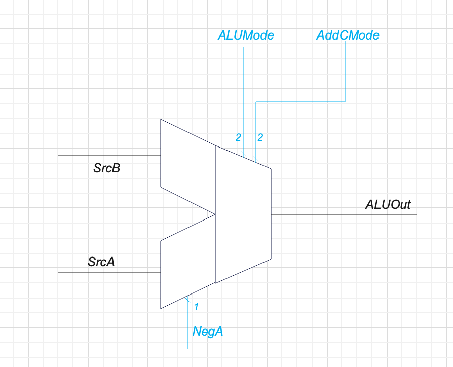
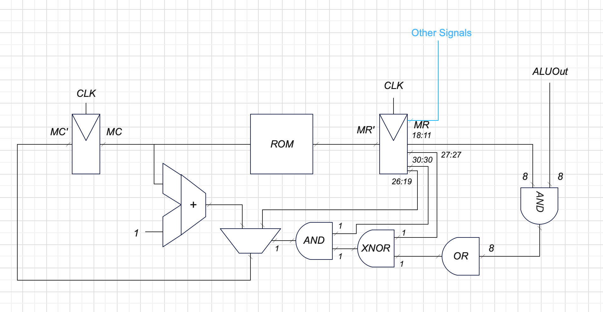
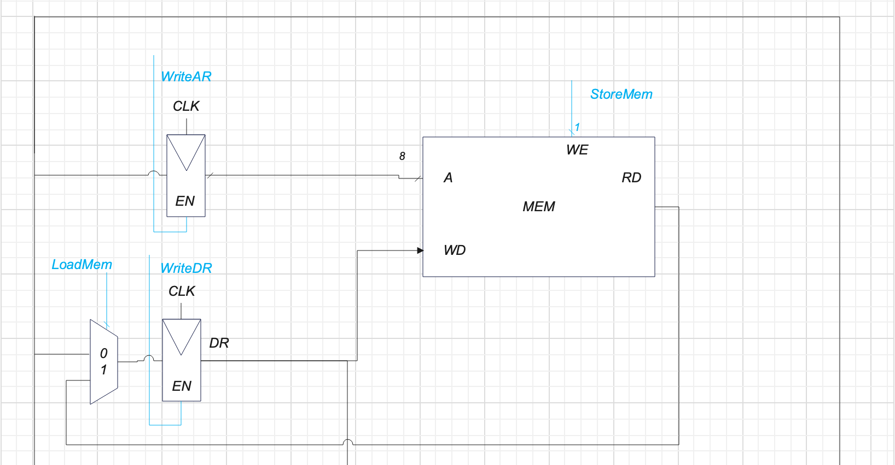
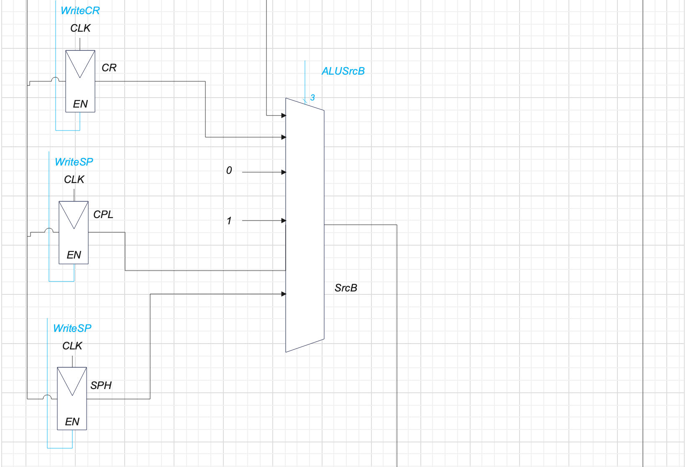
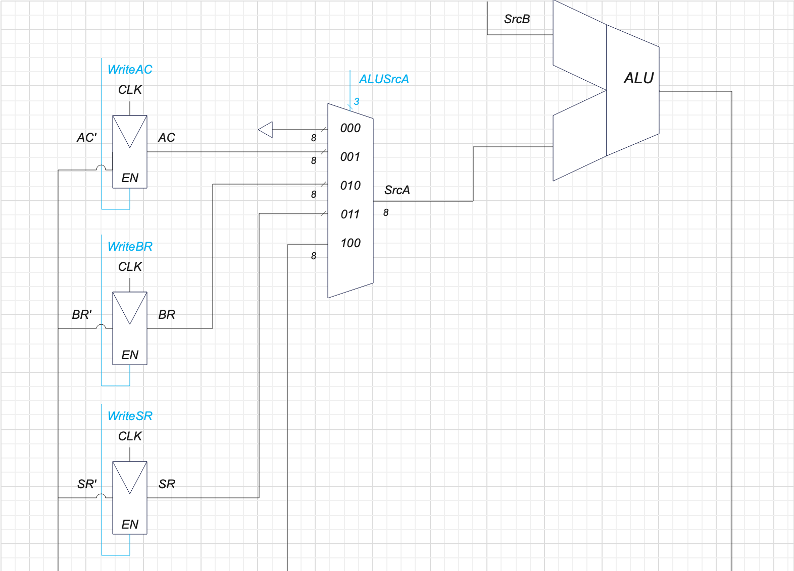
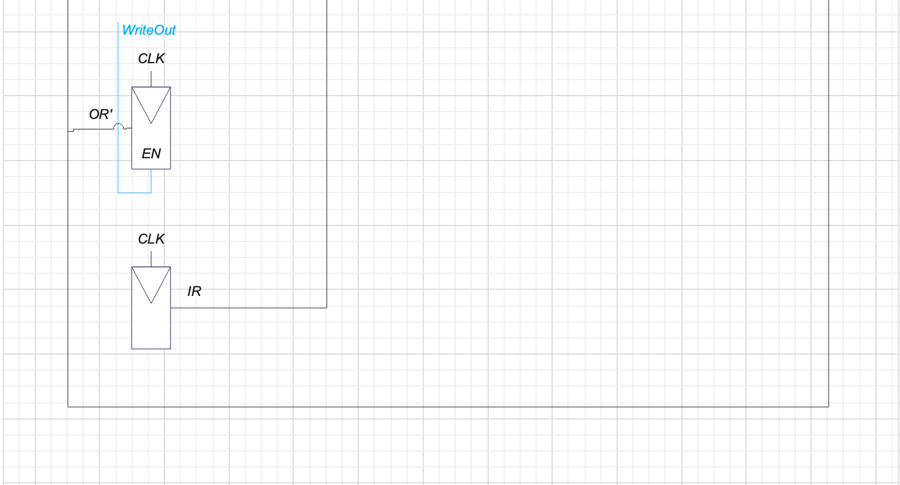

# cpu-simulator
Автор: Климович Вадим, P33091
```text
asm | acc | neum | mc | tick | struct | stream | port | pstr | prob2 | 8bit
```

## Язык программирования
```text
<инструкция> ::= <этикетка> : <значение> |
                 <этикетка> : <команда> |
                 <этикетка> : <команда> <операнд> |
                 <команда> |
                 <команда> <операнд> 
<этикетка> ::= <произвольное слово>
<тип адресации для числа> ::= "@" | "~" | "+" | "-" | "$"
<тип адресации для этикетки> ::= "~" | ""
<операнд> ::= <тип адресации для этикетки> <произвольное слово> |
              <тип адресации для числа> <адрес в виде числа>
```

## Организация памяти
Память разбита на 3 части: код (0-150), переменные (150-255), стек (0 - 255).
Возможно переполнение стека, программист имеет доступ к регистрам
- IR (регистр ввода) - только для чтения
- OR (регистр вывода) - только для записи
- AC (аккумулятор) - для бинарных и унарных операций

## Система комманд
### Унарные операции
* NOP (0x00) - пропуск
* HLT (0x10) - остановка
* CLA (0x20) - очистка аккумулятора
* CLC (0x28) - очистка флага С
* CMC (0x30) - инверсия флага С
* NOT (0x38) - инверсия аккумулятора
* INC (0x4C) - инкремент
* DEC (0x48) - декремент
* NEG (0x40) - сделать аккумулятор отрицательным
* POP (0x50) - снять значение со стека в аккумулятор
* PUSH (0x58) - положить значение аккумулятора в стек
* IN (0x68) - значение ввода в аккумулятор
* OUT (0x60) - значение аккумулятора в регистр вывода
* LD M (0xA0) - Загрузить М
* ST M (0xA8) - Сохранить М
### Бинарные операции
* AND M (0x80) - Логическое умножение
* OR M (0x88) - Логическое сложение
* ADD M (0x90) - Сложение
* ADC M (0x94) - Сложение (AC + M + C -> AC)
* CMP M (0x98) - Выставить флаги для операции AC - M
* SUB M (0x9C) - Вычитание
### Операции перехода
* RET (0x70) - возврат из подпрограммы
* CALL M (0xB0) - Вызов функции
* JUMP M (0xB8) - Переход
* JEQ M (0xC0) - Переход если равно
* JNE M (0xC4) - Переход если НЕ равно
* JPL M (0xC8) - Переход если положительное
* JMI M (0xCC) - Переход если отрицательное
* JCU M (0xD0) - Переход если С == 0
* JCS M (0xD4) - Переход если С == 1
* JVU M (0xD8) - Переход если V == 0
* JVS M (0xDC) - Переход если V == 1
* JGT M (0xE0) - Переход если больше
* JGE M (0xE4) - Переход если больше или равно
* JLT M (0xE8) - Переход если меньше
* JLE M (0xEC) - Переход если меньше или равно
* JIU M (0xF0) - Переход если ввод закончился
* JIS M (0xF4) - Переход если доступен символ для чтения из ввода


## Транслятор
Для запуска симуляции и транслятора необходимо выполнить комманду
```shell
python main.py <файл скрипта> [--input <файл ввода>] [--output <файл ввывода>]
```
Подробнее смотри
```shell
python main.py -h
```
Транслятор переводит весь код в двоичные данные и записывает в файл "памяти". 
Затем запускается процессор - микрокод начинает управлять выборкой команд и регистрами.
Микрокод хранится в файле [microcode.txt](files/microcode.txt).
Более подробно можно ознакомится посмотрев [файл](docs/microcode.xlsx) с комментариями к каждой микрокоманде.

## Модель процессора
Аккумуляторная структура с управляющим устройством на микрокоде.
### АЛУ

### Управляющее устройство

Микрокоманды делятся на управляющие и не управляющие.
Управляющие команды могут сравнить ОДИН любой бит с выхода АЛУ,
и на основе его значения изменить счетчик микрокоманды.

### Тракт данных





## Тестирование
Этап golden тестирования CI - "test".
### Вывод
Программа должна вывести строку `Hello, World!` [hello](golden/hello.yml).
### Ввод-вывод
Программа должна вывести строку введенную строку 
[cat](golden/cat.yml), [hello user](golden/hello_user_name.yml).
### Задача
[Программа](examples/progs/prob2.asm) должна найти сумму всех четных чисел ряда Фибоначи, не превышающих 4 млн.
Результат выводится в символах ascii ("Ffd" == 01000110.01100110.01100100 == 4613732) [prob2](golden/prob2.yml).
